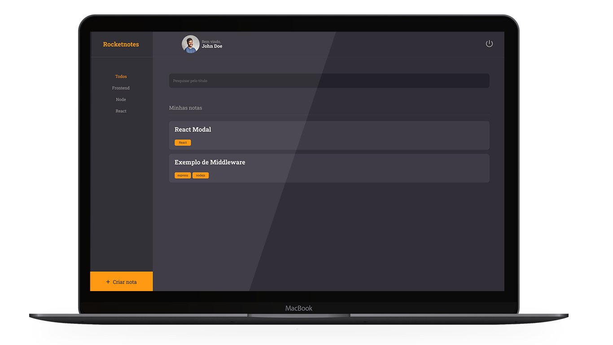

<p align="center">
  <a href="#-rocketnotes">About</a>&nbsp;&nbsp;&nbsp;|&nbsp;&nbsp;&nbsp;
  <a href="#-technologies">Technologies</a>&nbsp;&nbsp;&nbsp;|&nbsp;&nbsp;&nbsp;
  <a href="#-run-locally">Execute locally</a>&nbsp;&nbsp;&nbsp;|&nbsp;&nbsp;&nbsp;
  <a href="#-license">License</a>&nbsp;&nbsp;&nbsp;|&nbsp;&nbsp;&nbsp;
  <a href="#-developer">Develoepr</a>
</p>

<h2 align="center">RocketNotes</h2>
<div align="center">
  
</div>

## 📑 RocketNotes

RocketNotes is a note taker app which was developed as part of the Explorer program by [Rocketseat](https://rocketseat.com.br).
This application was developed using React JS, Styled-components for styling and communicates with an Restful API made with Node JS.

#### Functionalities

- Authentication using JWT token
- Filter notes by Tag names
- Search for an specific note
- Add links to your notes

## 🚀 Technologies

- React JS
- Styled-components
- ViteJS
- NodeJS

## 💻 Run locally

- clone this repo

```bash
  git clone git@github.com:vmsiqueira/rocketnotes.git
```
- access your project directory via terminal
- install all dependencies using npm or the package manager of your choice
```bash
  npm install
```
- after install all dependencies, in order to execute the application run:
```bash
  npm run dev
```
- open the application on your browser by clicking on the link that will show at the terminal window.

## ⚖️ License

This project is under MIT License. Check the [LICENSE](https://github.com/vmsiqueira/rocketnotes/blob/main/LICENSE) file for more details.


## 🌐 Developer
 <br>
- [Vitor Siqueira](https://www.github.com/vmsiqueira)

[](https://www.linkedin.com/in/vitor-siqueira-149a88201/)

---
Made with 💜 as part of my developer formation.

